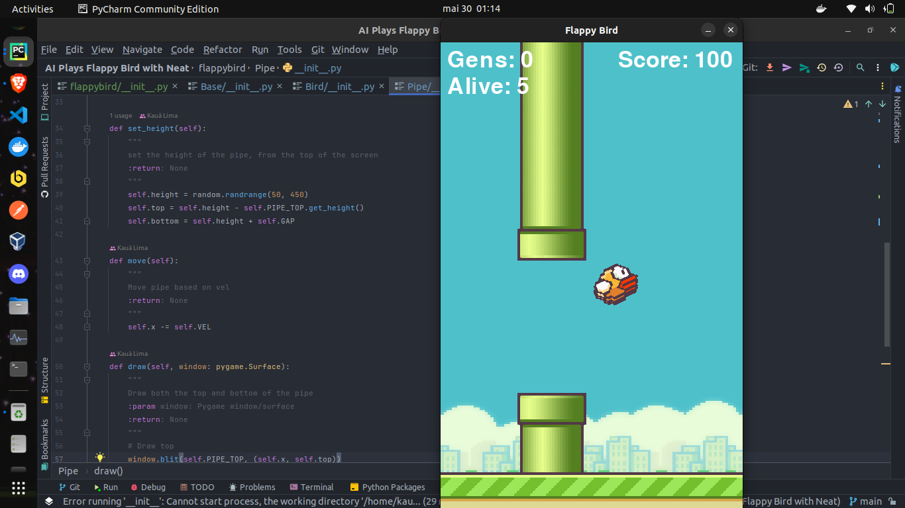

<h1 align="center">AI Plays Flappy Bird with NEAT</h1>

### Install dependencies
    pip install -r requirements.txt

### Run game
    python main.py
#### or 
    python3 main.py
### Use FlappyBird class
    local_dir = os.path.dirname(__file__)
    config_path = os.path.join(local_dir, 'config-feedforward.txt')
    
    flappy_game = FlappyBird()
    flappy_game.run(config_file=config_path)

----
## Project Image
